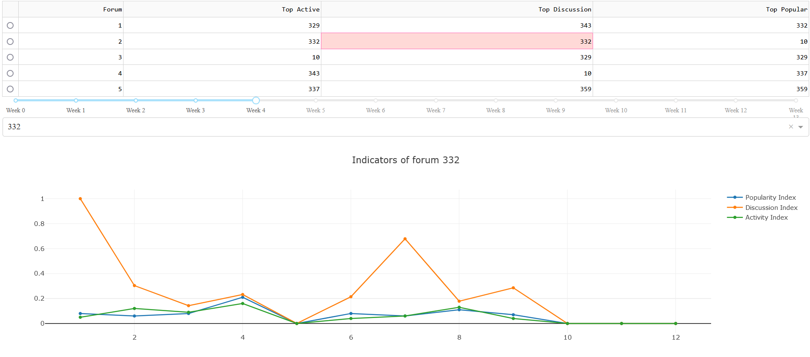

# Trace CMC
## Installation
Ce code utilise un corpus venant des traces d’un forum trouvable dans le fichier data/traceforum.sql, ce corpus a été adapté en le fichier action.json.
Vous pouvez recréer ce fichier en utilisant adapter.py avec ces commandes en remplaçant avec les valeurs qui conviennent à votre situation (il est nécessaire d’avoir chargé la base de donnée dans mySQL au préalable)
```bash
python
import adapter
sqlToActions("[Adresse de votre MySQL]","[VOtre nom d'utilisateur]","[Votre mot de passe]","[Votre base de donnée]")
```
Ensuite vous pouvez visualiser le dashboard qui affiche toutes les données
```bash
python dashboard.py
```
Enfin l’invité de commande vous indiquera un url pour afficher le dashboard.
## Principe
Nous allons analyser un corpus de données provenant des traces d’un forum de discussions, nous allons en extraire des indicateurs que nous allons afficher dans un dashboard.
Pour mon analyse de ces données, je vais faire un algorithme de recommandation selon trois critères, ces critères seront indiqués pour chaque semaine, Il sera possible de voir cinq recommandations par critère.

**Critère de discussion**: il indique le nombre de quote dans la semaine divisé par le nombre de messages, il permet de voir les forums où le plus de discussion est possible.


**critère de popularité**: il indique le nombre d'utilisateurs actifs dans le forum divisé par le total du nombre d'utilisateurs actif global, cela permet de voir les forums où il y a le plus de personnes actives. (Un utilisateur actif a au moins publié un message dans la semaine)


**critère d’activité**: il indique le nombre de messages publié dans ce forum divisé par le nombre de messages globaux, permet de voir le forum où les plus d’activité a lieu.

## Fonctionnement



Le dashboard présente un tableau avec un slider en dessous, ce slider permet de sélectionner la semaine dont vous voulez voir le top des indicateurs, la semaine 0 affiche un traitement des donnés sur l’intégralité du temps d’étude.
Le Dropdown permet de modifier le graphique pour afficher l'évolution des indicateurs pour chaque forum, il est aussi possible de sélectionner un forum depuis le tableau de top 5. 
